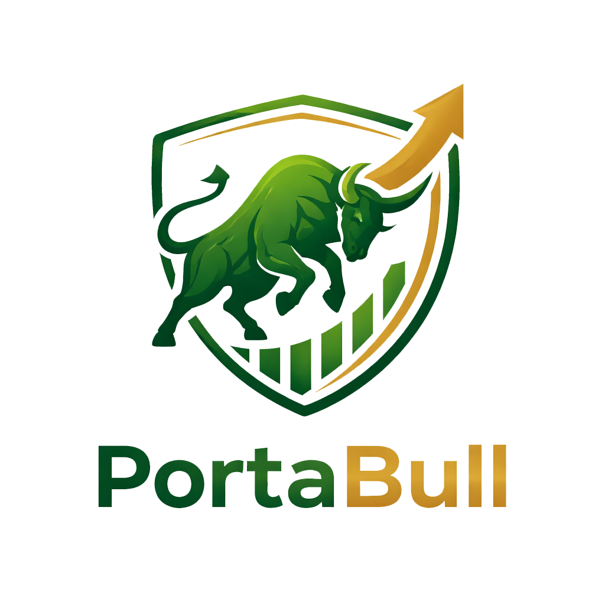
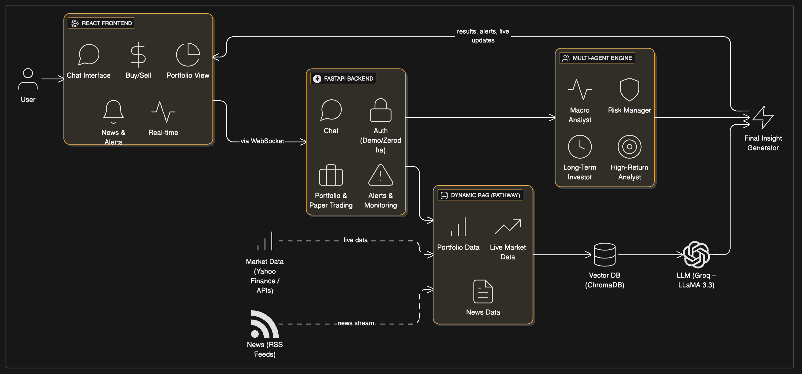

## PORTABULL

<p align="center">
	
</p>

**PORTABULL** = **PORTA**ble **BULL**ish portfolio.

The idea is simple: Portabull makes your stock portfolio **intelligent**, **bullish**, and **portable**.
You can plug in your Zerodha portfolio or use the built‑in paper trading mode, and get AI‑first insights just like having your own research desk.

---

## 1. Problem & Vision

Most retail investors:
- Don’t have time to track markets, news, and portfolio risk.
- See P&L numbers, but not **why** things are moving.
- Don’t get structured, research‑like hypotheses or action plans.

**Portabull** is a personal AI portfolio co‑pilot that:
- Connects to your **live Zerodha portfolio** (when linked), or
- Lets you trade in a safe **paper trading sandbox**, and
- Runs a **multi‑agent AI + live data + RAG** engine on top of it.

The goal: give you **clear, explainable, and actionable** insights, not just numbers.

---

## 2. What Portabull Does

### 2.1 Portfolio Inputs

Portabull can work with two types of portfolios:

- **Zerodha Portfolio (real)**  
	When the user connects with Zerodha, we read their live holdings and cash via the Kite APIs and treat it as the primary portfolio.

- **Paper Trading Portfolio (demo)**  
	For hackathon demos or users who don’t want to connect a broker, Portabull offers a full paper trading environment:
	- Search stocks (NSE/BSE universe).
	- Get live quotes and basic fundamentals.
	- Place **buy/sell** orders in a virtual account.
	- Track virtual P&L, holdings, cash, and recent transactions.

Both paths feed into the **same AI engine**, so everything you see (chat, hypotheses, alerts, news) works for real or paper portfolios.

---

### 2.2 Core Features

**1) Multi‑Agent AI Chat (Dragon‑style debate)**
- Chat interface where you ask questions like:
	- “Is my portfolio too risky?”
	- “What should I rebalance this month?”
	- “How exposed am I to IT or banking?”
- Under the hood, multiple specialized “agents” think from different angles:
	- Macro / market‑wide view
	- Risk & drawdown
	- Long‑term fundamentals
	- High‑return opportunities
- Their perspectives are then **summarized into one clear answer**, and you can optionally see the **agent debate** panel.

**2) Paper Trading Desk**
- Virtual trading environment with:
	- Smart stock search (by symbol, name, sector).
	- Live quotes and daily moves.
	- Buy/Sell modal with quantity control and position sizing.
	- Portfolio cards with per‑stock and overall P&L.
- Perfect for hackathon judges to test the system quickly without logging into Zerodha.

**3) Live Financial News Feed**
- Streaming news from top Indian financial sources (Economic Times, Moneycontrol, LiveMint, Business Standard, etc.).
- Articles tagged with **sentiment** (positive / negative / neutral) and linked to symbols.
- Filters to view:
	- All news
	- Only bullish or only bearish stories
	- Neutral / context articles

**4) Investment Hypotheses (AI Insights Panel)**
- The system reads your portfolio, market moves, and recent news, then generates structured hypotheses like:
	- “Bullish on Indian banking over 12–18 months due to credit growth.”
	- “Risk: High concentration in 2 IT stocks; consider partial trimming.”
	- “Opportunity: Under‑owned PSU with improving fundamentals.”
- Each hypothesis includes:
	- Title and type (bullish / bearish / risk / opportunity / hedging / rebalancing).
	- Affected symbols.
	- Confidence score.
	- Supporting evidence.
	- Suggested actions and risk factors.

**5) Real‑Time Alerts**
- Alert engine watches the (real or paper) portfolio for:
	- Sudden price spikes/drops.
	- Volume anomalies.
	- Portfolio drawdowns.
	- Unusual activity in key holdings.
- Alerts are shown in a dedicated **Alerts** tab with:
	- Type & severity.
	- Symbols involved.
	- Human‑readable description and suggested action.

**6) Theme & UX**
- Clean dashboard with tabs: Chat, Trade, News, Insights, Alerts, Portfolio.
- Brand‑aligned **Portabull** logo and amber/gold color palette.
- Built‑in **dark / light mode toggle**.

---

## 3. High‑Level Architecture

<p align="center">
	
</p>

Suggested structure for the diagram:
- **Frontend (React + Vite + Tailwind)**
	- Pages: Login, Dashboard
	- Components: Chat, PaperTradingPanel, PortfolioCard, NewsFeed, HypothesisPanel, AlertPanel
- **Backend (FastAPI, Python)**
	- Chat controller → Multi‑agent orchestrator + Groq LLaMA API
	- Portfolio controller → Zerodha + Paper trading engine
	- News controller → RSS scraper + sentiment tagger
	- Hypothesis generator → Portfolio + News + LLM
	- Alerts engine → Rules + anomaly checks
- **RAG & Data Layer**
	- Pathway streaming pipeline
	- ChromaDB vector store
	- yfinance for live prices
	- RSS feeds for news
- **External services**
	- Zerodha Kite APIs
	- Groq LLaMA 3.3 70B model

---

## 4. Technical Stack (Short)

- **Frontend**: React 18, TypeScript, Vite, TailwindCSS, Framer Motion, Zustand
- **Backend**: FastAPI, Python 3.11, Uvicorn
- **AI / LLM**: Groq API (llama‑3.3‑70b‑versatile)
- **RAG / Streaming**: Pathway, ChromaDB, yfinance
- **News**: feedparser, aiohttp, BeautifulSoup (RSS + HTML)
- **Broker**: Zerodha (Kite) integration for live portfolios

---

## 5. How It All Flows (Story Version)

1. User logs in with **Zerodha** or uses **Demo / Paper Trading**.
2. Backend builds a **current view of the portfolio** (holdings + cash + prices).
3. In parallel, the system:
	 - Streams and indexes **news articles**.
	 - Pulls **live market data** for relevant symbols.
	 - Stores everything in a **vector store** for semantic search.
4. When the user asks a question in chat, the backend:
	 - Retrieves rich context from the vector store + live data.
	 - Sends it to the **multi‑agent LLM pipeline**.
	 - Agents debate, then the system returns a single, clear answer plus optional debate view.
5. The **Hypothesis panel** and **Alerts** panel use the same data to:
	 - Proactively suggest ideas and risks.
	 - Highlight urgent events (big moves, drawdowns, anomalies).

Everything is designed so a judge can:
- Log in (or use demo),
- Click around 3–4 tabs, and
- Clearly see “this is an AI‑first portfolio cockpit”.

---

## 6. How to Run (Hackathon Setup)

### 6.1 Backend (FastAPI)

From the `backend` folder:

```bash
cd backend
python -m venv venv
source venv/bin/activate  # Windows: venv\Scripts\activate
pip install -r requirements.txt

# Set environment variables in backend/.env (Groq API key, Zerodha keys, etc.)

uvicorn main:app --reload --host 0.0.0.0 --port 8000
```

Backend will be available at: `http://localhost:8000`

### 6.2 Frontend (React + Vite)

From the `frontend` folder:

```bash
cd frontend
npm install
npm run dev
```

Frontend will be available at: `http://localhost:3000`

The Vite dev server is already configured to proxy API calls (`/api`, `/auth`, `/ws`) to the FastAPI backend.

---

## 7. Why This Fits the Hackathon Theme

- Uses **real broker portfolios (Zerodha)** and **safe paper trading** in one place.
- Shows a clear use of **multi‑agent LLMs + RAG + streaming data**.
- Focuses on **explainability**: hypotheses, debates, alerts, not just a chatbot.
- Built with **hackathon‑friendly stack** (FastAPI + React + Groq), easy to demo.

In short: **Portabull turns a static brokerage account into a live, intelligent, bullish co‑pilot that you can carry with you.**
